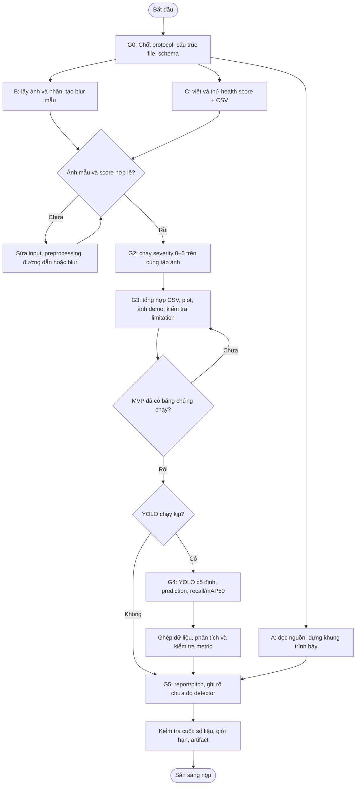

# T1 Camera Degradation Health Score — sơ đồ và checklist thực thi

Nguồn: [T1_Camera_Health_Project_Brief.md](T1_Camera_Health_Project_Brief.md), phiên bản 05/10/2026. Tài liệu này là kế hoạch chạy, **chưa phải kết quả thực nghiệm**.

## 1. Quy tắc chạy

- Đi theo thứ tự các cổng G0 → G5. Trong một cổng, A/B/C có thể làm song song sau khi giao diện bàn giao đã chốt.
- Ưu tiên **MVP**: cùng tập ảnh, severity 0–5, Laplacian variance, CSV, plot, ảnh minh họa, failure/limitation và report ngắn. Chỉ mở nhánh YOLO khi MVP đã chạy và còn thời gian/tài nguyên.
- Mọi kết quả trong report phải lấy từ file/log thực tế. Không điền số giả hoặc coi dự đoán là kết quả đo.
- Nếu cần giảm số ảnh, chọn danh sách ảnh cố định trước, rồi dùng **cùng danh sách** ở cả sáu điều kiện.
- Checklist này là điểm tiếp tục công việc: cập nhật `[x]`, đường dẫn artifact và ghi chú lỗi ngay khi hoàn thành task.

## 2. G0 — Chốt hợp đồng thực nghiệm (0–15 phút)

**Đầu ra cổng:** `config` hoặc ghi chú protocol, danh sách ảnh, schema bàn giao, phân công. Bắt đầu code sau khi các lựa chọn này nhất quán.

- [x] **T01 [A/B/C]** Xác nhận bài là T1, platform là xe ADAS, tính năng là phát hiện vật thể, sensor là camera trước, failure là motion blur.
- [x] **T02 [A/B/C]** Ghi câu hỏi chính và giả thuyết; ghi rõ score chỉ đo sắc nét, không phải xác suất camera hỏng.
- [x] **T03 [B]** Kiểm tra Python, CPU/GPU, dung lượng và quyền tải dữ liệu/weights; ghi kết quả.
- [x] **T04 [B/C]** Chốt tập ảnh dùng cho lần chạy: toàn bộ COCO128 hoặc subset cố định; lưu `image_id` và số ảnh.
- [x] **T05 [B/C]** Kiểm tra mỗi ảnh có đường dẫn ảnh và nhãn tương ứng; thống nhất cách xử lý ảnh không có GT.
- [x] **T06 [B/C]** Chốt lớp đánh giá: tất cả lớp COCO hiện diện; nếu lọc person/car phải lọc cả GT lẫn prediction.
- [x] **T07 [B/C]** Chốt severity `0,1,2,3,4,5`, trong đó 0 là ảnh gốc; công cụ blur là `imagecorruptions.motion_blur`.
- [x] **T08 [B/C]** Chốt `image_id`, cấu trúc thư mục, quy tắc đặt tên và cách giữ nguyên nhãn bbox.
- [x] **T09 [B/C]** Chốt preprocessing score: RGB uint8 đầu vào, grayscale OpenCV, thang 0–255, Laplacian `CV_64F`, `ksize=1`, variance.
- [x] **T10 [B/C]** Chốt hai schema ở mục 8 của brief: `image_metrics.csv` theo ảnh và `condition_summary.csv` theo severity; ô chưa đo để trống/NaN, không điền 0.
- [x] **T11 [B/C]** Nếu mở rộng YOLO: chốt `yolov8n.pt`, `imgsz=640`, `conf=0.25` cho prediction vận hành, NMS IoU, `max_det`, device, precision, evaluator và class mapping.
- [x] **T12 [A]** Tạo khung slide/report trống với Problem, Method, Benchmark, Failure case, Engineering decision; để ô số liệu trống.
- [x] **T13 [A/B/C]** Ghi protocol đã chốt và người phụ trách từng file; chuyển G1.

## 3. G1 — Chạy thử trên một cặp ảnh (15–45 phút)

**Đầu ra cổng:** một ảnh gốc, một ảnh blur, nhãn đúng, hai score đo được, log và script chạy lại được.

### B — Dữ liệu và blur mẫu

- [x] **T14 [B]** Tải/định vị COCO128; ghi nguồn và đường dẫn dữ liệu.
- [x] **T15 [B]** Liệt kê ảnh và nhãn; đối chiếu số lượng và `image_id`.
- [x] **T16 [B]** Chọn một ảnh mẫu có nhãn rõ và ghi kích thước gốc.
- [x] **T17 [B]** Đọc ảnh mẫu; kiểm tra RGB, dtype `uint8`, kênh màu và kích thước.
- [x] **T18 [B]** Tạo một ảnh `motion_blur` severity 1; ghi seed nếu phép biến đổi có ngẫu nhiên.
- [x] **T19 [B]** Kiểm tra ảnh blur mở được, không đổi width/height và khớp `image_id`.
- [x] **T20 [B]** Xác nhận nhãn bbox của ảnh mẫu không bị thay đổi; nếu có resize, áp dụng cùng biến đổi cho ảnh và bbox rồi ghi log.
- [x] **T21 [B]** Gửi C đường dẫn ảnh gốc, ảnh blur, nhãn mẫu, format prediction dự kiến và config.

### C — Score và schema mẫu

- [x] **T22 [C]** Tạo hàm đọc ảnh thô; không dùng ảnh đã vẽ bbox/text để tính score.
- [x] **T23 [C]** Tạo hàm chuyển grayscale nhất quán cho cả ảnh gốc và blur.
- [x] **T24 [C]** Tạo hàm tính `cv2.Laplacian(..., cv2.CV_64F, ksize=1).var()`.
- [x] **T25 [C]** Tính score ảnh gốc và ảnh blur mẫu; kiểm tra số hữu hạn, không âm.
- [x] **T26 [C]** Ghi hai dòng mẫu đúng schema `image_metrics.csv`; các cột detection chưa đo để trống/NaN.
- [x] **T27 [C]** Kiểm tra `image_id`, severity, path, width/height đúng với ảnh thực.
- [x] **T28 [C]** Lưu command chạy, phiên bản thư viện và log lỗi nếu có.

### A — Nguồn và lời giải thích

- [x] **T29 [A]** Đọc yêu cầu/rubric trong PDF và xác nhận đầu ra T1 cần nộp.
- [x] **T30 [A]** Ghi bảng nguồn: paper/repo, input, output, metric, limitation; không lấy kết quả paper làm kết quả nhóm.
- [x] **T31 [A]** Viết 2–3 câu giải thích motion blur, Laplacian variance và giới hạn scene ít texture.
- [x] **T32 [A]** Soạn phần Problem/Method trong slide nhưng chưa điền số liệu.

**Cổng kiểm tra G1**

- [x] **T33 [B/C]** Mở trực quan cặp ảnh; xác nhận blur có hiệu ứng và nhãn không lệch.
- [x] **T34 [B/C]** Chạy lại score từ command đã lưu; đối chiếu CSV với stdout/log.
- [x] **T35 [B/C]** Nếu G1 lỗi: sửa đúng khâu gây lỗi, chạy lại T17–T34; không bỏ ảnh lỗi âm thầm.

## 4. G2 — Chạy MVP trên cả sáu điều kiện (45–70 phút)

**Đầu ra cổng:** `N` ảnh gốc + `5N` ảnh blur, một score/ảnh/điều kiện, manifest và log kiểm tra.

- [x] **T36 [B]** Khóa manifest `image_id` cho `N` ảnh; ghi `N` thực tế.
- [x] **T37 [B]** Tạo output severity 0 bằng ảnh gốc hoặc tham chiếu ảnh gốc; không sửa pixel/nhãn.
- [x] **T38 [B]** Lặp severity 1–5 trên từng ảnh trong manifest, lưu đúng tên và cấu trúc đã chốt.
- [x] **T39 [B]** Ghi seed/cấu hình blur, lỗi đọc/ghi và cách xử lý kích thước không được hỗ trợ.
- [x] **T40 [B]** Đếm ảnh ở từng severity; mọi điều kiện phải có cùng `N` và cùng `image_id`.
- [x] **T41 [B]** So sánh width/height của từng biến thể với ảnh gốc; đối chiếu nhãn.
- [x] **T42 [C]** Đọc toàn bộ ảnh thô ở severity 0–5 và tính score theo đúng một hàm preprocessing.
- [x] **T43 [C]** Ghi `image_metrics.csv`, một dòng cho mỗi `(image_id, severity)`; kỳ vọng `6N` dòng và khóa duy nhất.
- [x] **T44 [C]** Kiểm tra score đều hữu hạn, không âm; liệt kê trường hợp bất thường để xem ảnh.
- [x] **T45 [C]** Tính median, Q1, Q3 hoặc IQR theo severity; ghi `condition_summary.csv` với cột detection chưa đo để trống.
- [x] **T46 [C]** Tạo plot severity 0–5 so với median Laplacian variance, có nhãn trục/đơn vị quy ước và số ảnh.
- [x] **T47 [B/C]** Tạo panel cùng một `image_id`: ảnh gốc và severity 1–5, cùng cách hiển thị.
- [x] **T48 [C]** Tìm ít nhất một case cho thấy score có giới hạn, ví dụ cảnh ít texture hoặc score không giảm đều; ghi `image_id` và số đo thật.
- [x] **T49 [B/C]** Kiểm tra CSV, plot và panel đều dùng cùng manifest và cùng severity.

## 5. G3 — Chốt MVP trước khi mở rộng (khoảng 70 phút)

**MVP chỉ đạt khi có bằng chứng chạy thật và lời giải thích đúng giới hạn.**

- [x] **T50 [C]** Đối chiếu ngẫu nhiên vài dòng CSV với ảnh và hàm score; kiểm tra có đúng `6N` dòng.
- [x] **T51 [A/C]** Viết nhận xét xu hướng bằng số thực (median/IQR); nếu không đơn điệu, mô tả đúng như dữ liệu.
- [x] **T52 [A/C]** Viết limitation: score phụ thuộc texture, ánh sáng/preprocessing; không chứng minh detector giảm chất lượng.
- [x] **T53 [A]** Điền số ảnh, cấu hình, plot, panel và failure case thật vào report/slide.
- [x] **T54 [A/B/C]** Kiểm tra có script, config, CSV, log, ảnh demo, plot và command tái chạy.
- [x] **T55 [A/B/C]** Quyết định còn đủ thời gian để mở nhánh YOLO hay đi thẳng G5; ghi quyết định. Nếu không chạy YOLO, report phải ghi rõ **chưa đo tác động lên detector**.

## 6. G4 — Nhánh mở rộng YOLO, chỉ sau G3 (70–95 phút nếu khả thi)

**Đầu ra nhánh:** prediction và metric có protocol rõ ràng; score MVP vẫn là kết quả chính nếu nhánh này lỗi hoặc quá chậm.

### B — Inference và evaluator

- [x] **T56 [B]** Cài/kiểm tra Ultralytics và `yolov8n.pt`; ghi phiên bản và checksum/tên weights nếu có.
- [x] **T57 [B]** Chạy thử một ảnh gốc và một ảnh blur; đo thời gian và kiểm tra prediction đọc được.
- [x] **T58 [B]** Ước lượng thời gian cho `6N`; nếu không kịp, giảm `N` theo cùng manifest ở cả sáu điều kiện hoặc dừng nhánh mở rộng.
- [x] **T59 [B]** Chốt/cất config thực chạy: weights, imgsz, conf, NMS IoU, max_det, device, precision, classes và command.
- [x] **T60 [B]** Chạy prediction tại `conf=0.25` trên sáu điều kiện với cùng model/config.
- [x] **T61 [B]** Export prediction theo từng ảnh: `image_id`, severity, class, confidence, bbox và kích thước ảnh.
- [x] **T62 [B]** Kiểm tra class ID và hệ tọa độ bbox của prediction khớp nhãn; kiểm tra trên ảnh mẫu có vẽ box.
- [x] **T63 [B]** Chạy validation mAP50 với evaluator/protocol cố định; dùng ngưỡng confidence thấp phù hợp cho đường precision–recall và ghi rõ giá trị.
- [x] **T64 [B]** Lưu metric theo severity, số ảnh/GT, log, thời gian và lỗi; không gọi recall evaluator là `recall_at_025` nếu operating point khác.

### C — Matching, tổng hợp, phân tích

- [x] **T65 [C]** Chọn thuật toán matching một-một, cùng class và IoU ≥ 0.5; xác định thứ tự ưu tiên dự đoán.
- [x] **T66 [C]** Kiểm tra matching bằng ví dụ nhỏ: một GT–một prediction, duplicate prediction, sai class, thiếu prediction.
- [x] **T67 [C]** Ghép GT, prediction và score bằng khóa `(image_id, severity)`; báo khóa thiếu/trùng.
- [x] **T68 [C]** Tính `n_gt`, `n_pred`, TP, FP, FN từng ảnh; xác nhận `TP + FN = n_gt` và `TP + FP = n_pred` theo phạm vi đánh giá.
- [x] **T69 [C]** Tính recall từng ảnh khi `n_gt > 0`; đặt NaN nếu `n_gt = 0`.
- [x] **T70 [C]** Tính mean confidence trên prediction còn lại sau threshold/NMS; đặt NaN nếu `n_pred = 0`.
- [x] **T71 [C]** Cập nhật `image_metrics.csv`; kiểm tra không đổi score và khóa cũ.
- [x] **T72 [C]** Tính recall toàn tập từ tổng TP/(TP+FN), không lấy trung bình recall ảnh.
- [x] **T73 [C]** Nhập mAP50 từ evaluator và cập nhật `condition_summary.csv` với protocol tương ứng.
- [x] **T74 [C]** Vẽ severity–recall và severity–mAP50, trục có nhãn rõ; có thể tách plot nếu thang đo khác.
- [x] **T75 [C]** Chọn failure case thực tế từ prediction/GT, gồm trường hợp không ủng hộ giả thuyết nếu có.
- [ ] **T76 [C]** Nếu dữ liệu per-image hợp lệ: vẽ scatter score–recall và tính Spearman trên đơn vị quan sát đã ghi; báo số quan sát hợp lệ, không diễn giải các severity của cùng ảnh như mẫu độc lập.
- [x] **T77 [A/B/C]** Đối chiếu số detector trong CSV với log/evaluator; giải thích nếu protocol conf=0.25 và AP khác nhau.

## 7. G5 — Phân tích quyết định và nộp (95–120 phút)

- [x] **T78 [A/C]** Chọn một failure/limitation có ảnh và số đo thực; nói rõ hiện tượng và nguyên nhân có thể, không khẳng định quá dữ liệu.
- [x] **T79 [A/C]** Nêu quyết định kỹ thuật có điều kiện: score thấp kéo dài qua nhiều frame có thể kích hoạt cờ chất lượng và cân nhắc giảm tin cậy camera.
- [x] **T80 [A/C]** Nêu trade-off: ngưỡng nhạy gây false alarm ở cảnh ít texture; ngưỡng lỏng có thể bỏ sót blur.
- [x] **T81 [A/C]** Nêu một cải tiến khả thi: ngưỡng theo bối cảnh, kết hợp exposure/texture hoặc smoothing theo thời gian; ghi là đề xuất chưa kiểm chứng.
- [x] **T82 [A]** Hoàn thiện report/slide theo Problem → Method → Benchmark → Failure → Engineering decision.
- [x] **T83 [A]** Phân biệt kết quả paper/repo với kết quả nhóm; trích đúng nguồn cho phương pháp và dữ liệu.
- [x] **T84 [A]** Viết lời trình bày 3–5 phút và dùng số liệu có thật trong CSV/log.
- [x] **T85 [A/B/C]** Kiểm tra rubric: demo 40%, hiểu failure 25%, thuật toán 20%, trade-off 15%.
- [x] **T86 [A/B/C]** Kiểm tra không gọi COCO128 là benchmark lái xe hay test độc lập; không tuyên bố score là xác suất lỗi camera.
- [x] **T87 [A/B/C]** Kiểm tra mọi hình/bảng có `N`, severity, metric, cấu hình và nguồn khi cần.
- [x] **T88 [A/B/C]** Mở toàn bộ artifact cuối và thử command tái chạy tối thiểu; sửa đường dẫn hỏng.
- [ ] **T89 [A/B/C]** Duyệt bài nói thử và bàn giao thư mục nộp.

## 8. Nhánh tùy chọn sau khi phần chính hoàn thành

- [ ] **T90 [C]** Nếu thật sự còn thời gian, định nghĩa trước thế nào là detection kém và chọn ngưỡng health score trên tập ảnh phát triển.
- [ ] **T91 [C]** Tách theo `image_id` để mọi severity của một ảnh nằm cùng split; đo false alarm và missed alarm trên ảnh giữ riêng.
- [ ] **T92 [A/C]** Nếu không có tập giữ riêng, chỉ trình bày ngưỡng thăm dò, không gọi là ngưỡng đã xác nhận.

## 9. Bàn giao file và thứ tự tiếp tục

| Artifact | Người tạo | Người dùng tiếp | Điều kiện tối thiểu |
|---|---|---|---|
| Manifest ảnh + nhãn + config | B | C, A | Cùng `image_id` cho severity 0–5 |
| Ảnh blur thô + log | B | C, A | Cùng kích thước, không vẽ box lên ảnh tính score |
| `image_metrics.csv` | C | A | Một dòng/(ảnh, severity), `6N` dòng |
| `condition_summary.csv` + plot | C | A | Median và số ảnh thật; detection để trống nếu chưa đo |
| Prediction + validation log (nếu có) | B | C | Có class, bbox, confidence, protocol |
| Slide/report/pitch | A | Cả nhóm | Chỉ dùng số liệu được đối chiếu từ artifact |

**Khi mở lại công việc:** (1) đọc file này, (2) tìm checkbox đầu tiên chưa xong trong cổng hiện tại, (3) kiểm tra artifact của cổng trước, (4) làm task tiếp theo, (5) cập nhật checkbox và ghi đường dẫn/kết quả bên dưới. Không đánh dấu hoàn thành chỉ vì đã viết code; cần chạy và kiểm tra đầu ra.

### Nhật ký chạy

| Thời điểm | Cổng/task | Artifact hoặc kết quả | Lỗi/quyết định tiếp theo |
|---|---|---|---|
| 05/10/2026 | G0–G5, T01–T88 trừ T76 | `run_project.py`, `outputs/` với 128 ảnh × 6 điều kiện, CSV, prediction, plot, report, pitch và `output/pdf/T1_One_Page.pdf`; `verify_project.py` PASS | T76 Spearman per-image là mở rộng, chưa thực hiện; không dùng p-value giả độc lập |
| 05/10/2026 | Đối chiếu PDF gốc | Đã đọc trang 1–4 và 8; bổ sung saturation ratio/entropy ở `quality_metrics.csv` | T89 cần nhóm tự tập trình bày; T90–T92 là thử ngưỡng tùy chọn, chưa xác nhận |
