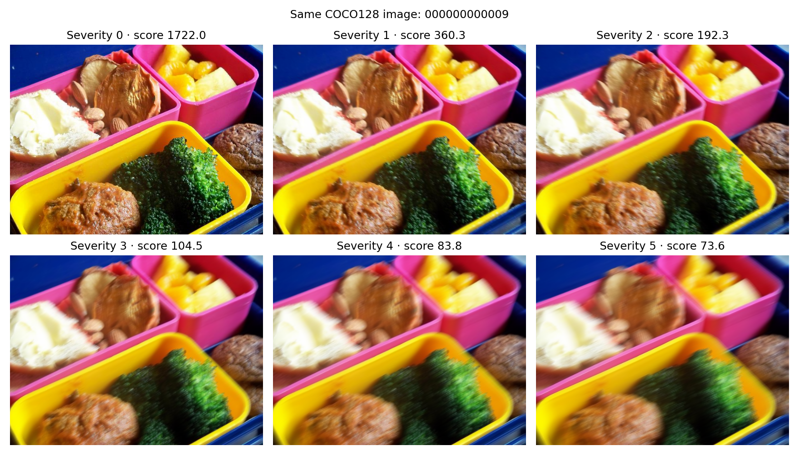
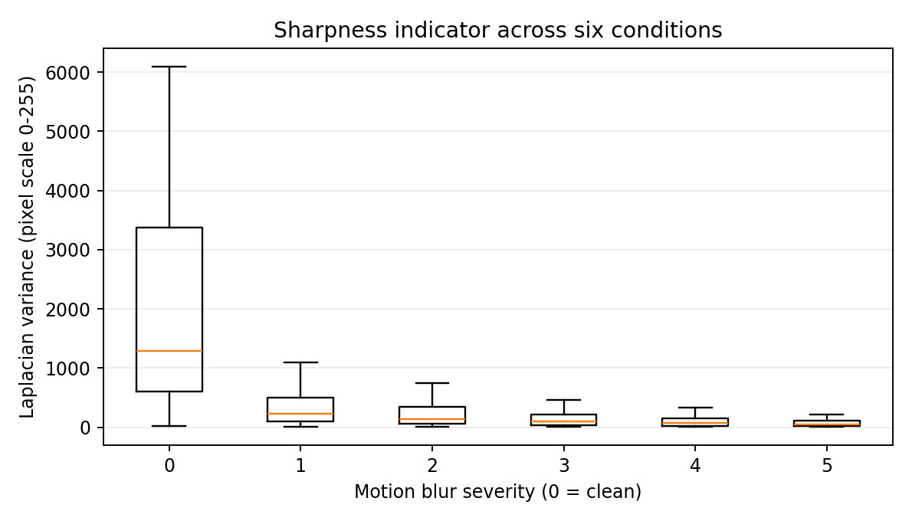
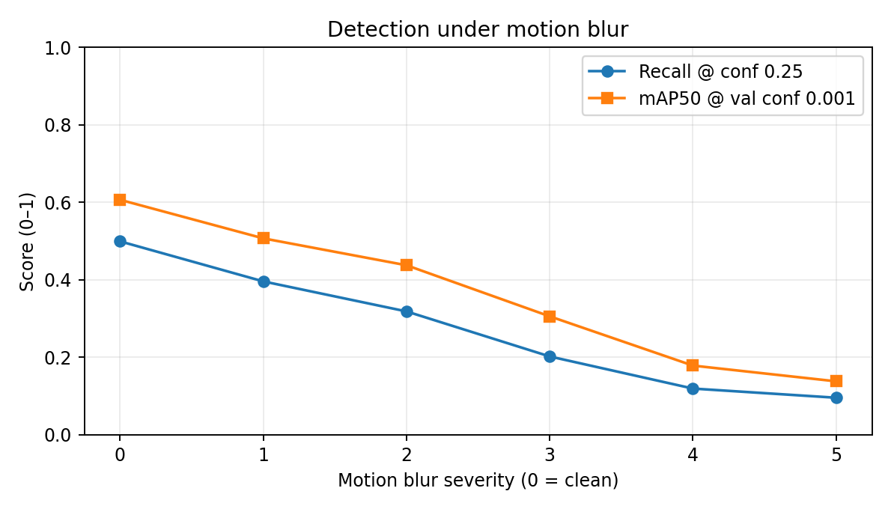
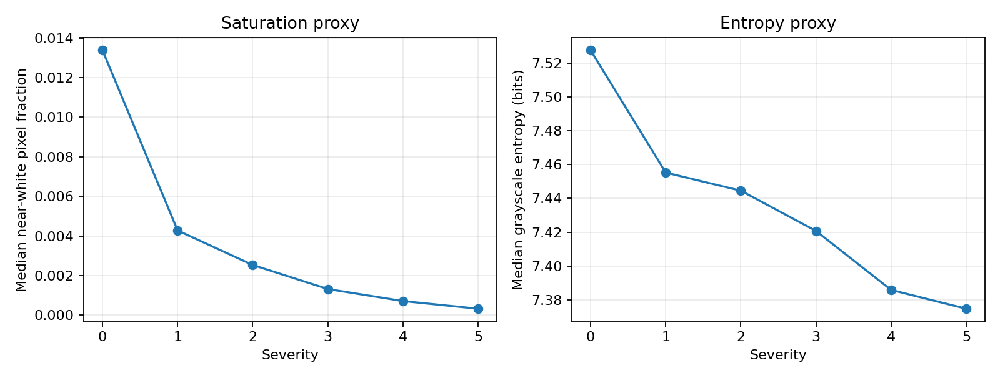
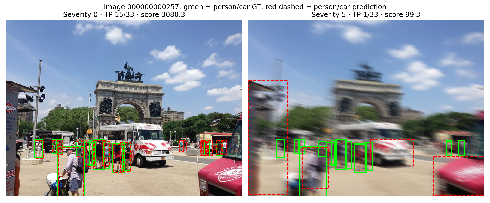
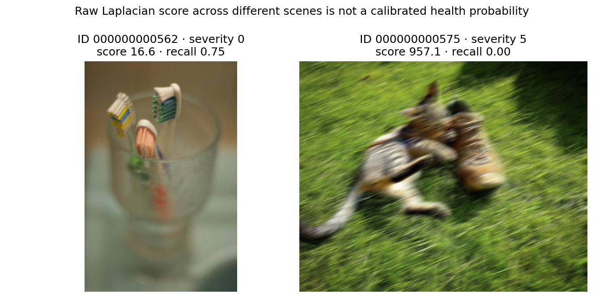

# Báo cáo T1 — Camera degradation health score

## Problem

Xe ADAS dùng camera trước để phát hiện vật thể. Motion blur có thể làm mất chi tiết ảnh và ảnh hưởng khả năng phát hiện. Thí nghiệm này dùng COCO128 để minh họa trên **128 ảnh**, không phải kiểm định trên xe thật.

## Method

Cùng 128 ảnh và nhãn được dùng cho severity 0 (gốc) và 1–5 (`imagecorruptions.motion_blur`, seed 20261005). Ảnh JPEG nguồn được giải mã rồi lưu mọi điều kiện thành PNG lossless. Chỉ báo sắc nét là variance của Laplacian sau chuyển RGB uint8 sang grayscale ở thang pixel 0–255 (`CV_64F`, `ksize=1`). Nó không phải xác suất camera khỏe/hỏng. YOLOv8n được giữ cố định; recall đo tại confidence 0.25 bằng matching một-một, cùng class, IoU ≥ 0.5. mAP50 lấy từ Ultralytics `model.val` tại confidence 0.001.

## Benchmark

| Severity | N ảnh | Median Laplacian | IQR | Số detection | Recall @ 0.25 | mAP50 | Mean confidence |
|---:|---:|---:|---:|---:|---:|---:|---:|
| 0 | 128 | 1284.6 | 2779.2 | 649 | 0.499 | 0.607 | 0.585 |
| 1 | 128 | 229.4 | 408.7 | 523 | 0.396 | 0.507 | 0.575 |
| 2 | 128 | 139.9 | 279.1 | 431 | 0.319 | 0.438 | 0.562 |
| 3 | 128 | 95.6 | 173.2 | 309 | 0.202 | 0.306 | 0.554 |
| 4 | 128 | 68.0 | 125.2 | 192 | 0.119 | 0.179 | 0.528 |
| 5 | 128 | 49.6 | 87.9 | 166 | 0.096 | 0.138 | 0.483 |

Từ severity 0 đến 5, recall giảm 40.4 điểm phần trăm và mAP50 giảm 46.9 điểm phần trăm. Mean confidence tính trên các prediction còn lại sau ngưỡng/NMS; không thể thay cho recall.

Chỉ số phụ theo đề gốc: median saturation ratio (tỷ lệ pixel có ít nhất một kênh RGB ≥250) từ 0.013 đến 0.000; median entropy histogram grayscale từ 7.53 đến 7.37 bit. Đây là proxy phụ thuộc nội dung cảnh và xử lý ảnh, không phải phép đo vật lý của sensor. Xem `quality_metrics.csv`, `quality_summary.csv` và hình dưới.

## Failure case và giới hạn

Ảnh `000000000257` có 33 GT (mọi lớp); TP ở confidence 0.25 giảm từ 15 (ảnh gốc) xuống 1 (severity 5), trong khi Laplacian variance giảm từ 3080.3 xuống 99.3. Hình đánh dấu GT người/xe màu xanh và prediction người/xe nét đỏ. TP ghi trên hình là tất cả lớp COCO, không phải metric riêng người/xe.

Ví dụ giới hạn của ngưỡng score tuyệt đối: ảnh gốc `000000000562` vốn ít chi tiết/ngoài tiêu điểm có score 16.6 nhưng recall 0.75; ảnh `000000000575` tại severity 5 vẫn có score 957.1. Score giữa hai cảnh khác nhau không đủ để phân loại blur hay quyết định down-weight camera.

Score Laplacian phản ứng với chi tiết/cạnh của cảnh, nên cảnh ít texture có thể cho score thấp dù ảnh không bị motion blur. Dữ liệu COCO128 là subset nhỏ của COCO train2017 và dùng cùng ảnh cho train/val trong cấu hình gốc; ở đây chỉ đánh giá model pretrained, không train. Blur tổng hợp severity 1–5 không tương ứng trực tiếp tốc độ xe hoặc thời gian phơi sáng. Không suy rộng kết quả thành hiệu năng ADAS ngoài đường.

## Engineering decision

Có thể nghiên cứu cờ chất lượng khi score thấp kéo dài qua nhiều frame rồi cân nhắc giảm mức tin cậy camera. Cần thử trên dữ liệu tách theo ảnh, đánh giá false alarm/missed alarm và bối cảnh ít texture trước khi chọn ngưỡng; hiện chưa xác nhận ngưỡng vận hành. Có thể cải tiến bằng kết hợp texture/exposure và smoothing theo thời gian.

## Tái lập và nguồn

Chạy `python run_project.py prepare`, `python run_project.py analyze`, `python run_project.py detect`, `python run_project.py report` (chi tiết trong [README](../README.md)). Config thực chạy và phiên bản trong `run_metadata.json`; dữ liệu từng ảnh ở `image_metrics.csv`, từng điều kiện ở `condition_summary.csv`. Bảng input/output/metric/limitation của tài liệu tham khảo ở [SOURCES](../SOURCES.md).

- Đề bài: PDF Sensor Reality Sprint trong thư mục gốc; [brief nhóm](../T1_Camera_Health_Project_Brief.md).
- [COCO128](https://docs.ultralytics.com/datasets/detect/coco128/) và [Ultralytics validation](https://docs.ultralytics.com/modes/val/).
- [imagecorruptions](https://github.com/bethgelab/imagecorruptions).
- Michaelis et al., [Benchmarking Robustness in Object Detection](https://arxiv.org/abs/1907.07484); Hendrycks & Dietterich, [Common Corruptions](https://arxiv.org/abs/1903.12261). Hai paper là nền tảng phương pháp; bảng trên là số liệu nhóm tự chạy, không phải kết quả tái lập toàn bộ paper.
